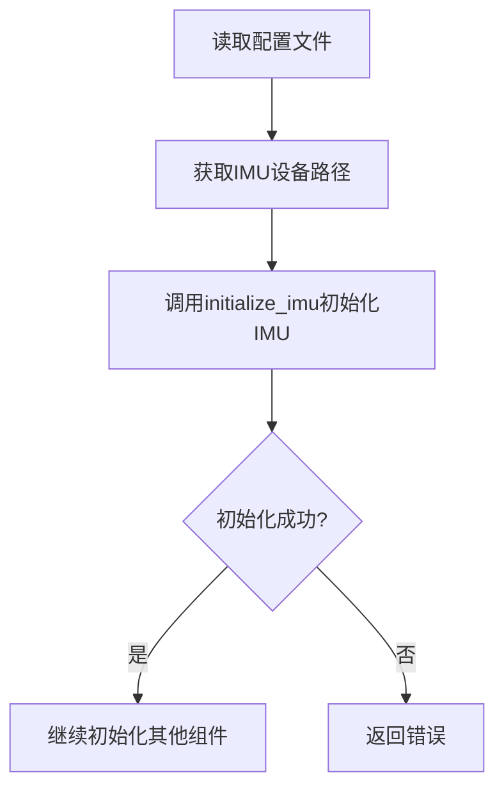
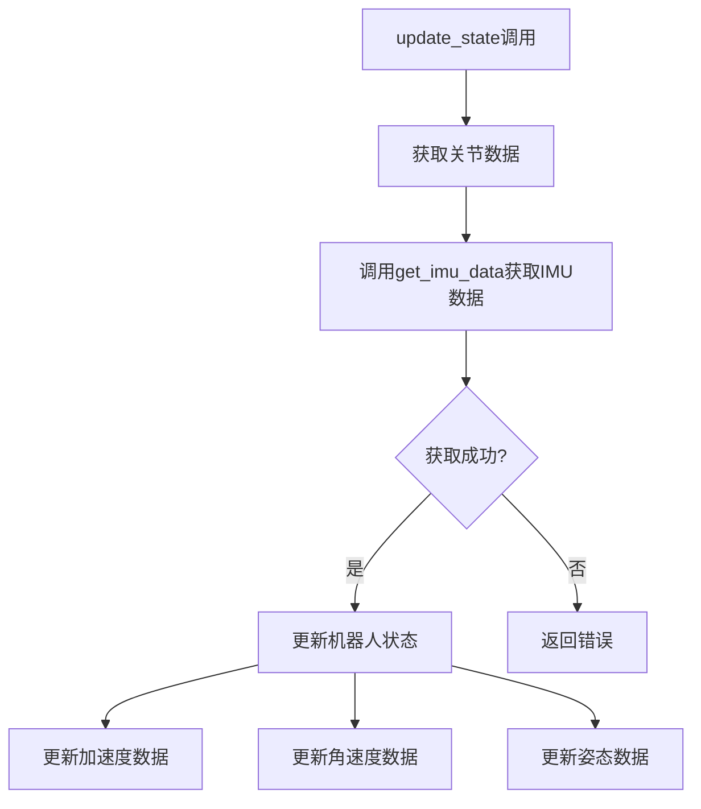

# IMU数据获取流程说明

## 整体架构

IMU（惯性测量单元）数据的获取在这个项目中采用了分层的架构设计：

1. **底层驱动层**：直接与IMU硬件通信
2. **中间接口层**：提供C语言接口封装
3. **上层控制层**：在Robot类中集成IMU功能

## 数据获取流程

### 1. 初始化流程



初始化步骤：
1. 从配置文件（YAML）中读取IMU设备路径
2. 调用 `initialize_imu()` 函数初始化IMU设备
3. 检查初始化结果，失败则返回错误

### 2. 数据更新流程



数据更新步骤：
1. 在Robot类的 `update_state()` 函数中调用 `get_imu_data()`
2. 获取IMU的最新数据
3. 将IMU数据转换为机器人基座状态

### 3. 数据结构

IMU数据包含以下信息：
- 加速度（acc_x, acc_y, acc_z）：单位 m/s²
- 角速度（gyro_x, gyro_y, gyro_z）：单位 rad/s
- 欧拉角（pitch, roll, yaw）：单位 rad
- 四元数（quaternion_w, quaternion_x, quaternion_y, quaternion_z）

## 代码实现

### 1. 配置文件参数
```yaml
# IMU device path
imu_dev: /dev/ttyS4
```

### 2. 初始化代码
```cpp
// 从配置文件读取IMU设备路径
std::string imu_path = config_["imu_dev"].as<std::string>();
// 初始化IMU
err = initialize_imu(imu_path.c_str());
```

### 3. 数据更新代码
```cpp
// 获取IMU状态
err = get_imu_data(&imu_data_);
if (err != 0) {
    return -2;
}

// 转换IMU状态到机器人基座状态
state_->base.acc_x = imu_data_.acc_x;
state_->base.acc_y = imu_data_.acc_y;
state_->base.acc_z = imu_data_.acc_z;
// ... 更新其他数据
```

## 注意事项

1. **设备路径**
   - IMU设备路径在配置文件中指定
   - 默认使用串口设备（/dev/ttyS4）

2. **数据更新频率**
   - IMU数据更新与机器人状态更新同步
   - 在每个控制循环中都会获取最新的IMU数据

3. **错误处理**
   - 初始化失败时返回错误代码-2
   - 数据获取失败时会打印错误信息

4. **数据同步**
   - IMU数据作为机器人状态的一部分被更新
   - 确保了控制系统使用的是最新的IMU数据

## 扩展开发

如果需要扩展IMU功能，可以：

1. 修改IMU配置参数
2. 添加新的IMU数据处理函数
3. 实现数据滤波或融合算法
4. 添加IMU数据记录功能
