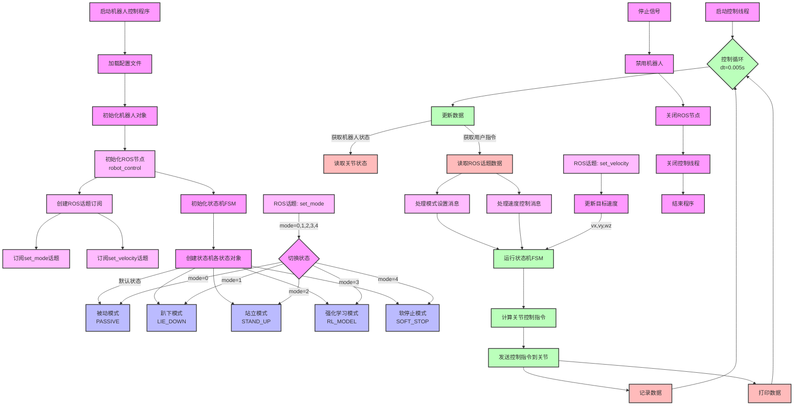

# 机器人控制流程图

## 流程说明

1. **初始化阶段**
   - 加载配置文件（`config/devq.yaml`）
   - 初始化机器人对象
   - 初始化ROS节点（robot_control）和话题订阅
   - 创建并初始化状态机（FSM）的各个状态

2. **ROS通信**
   - 创建ROS节点和话题订阅
   - 处理set_mode话题的模式切换指令
   - 处理set_velocity话题的速度控制指令
   - 通过回调函数更新控制命令

3. **状态机状态**
   - PASSIVE（被动模式）：默认状态，机器人不执行主动运动
   - LIE_DOWN（趴下模式）：控制机器人完成趴下动作
   - STAND_UP（站立模式）：控制机器人完成站立动作
   - RL_MODEL（强化学习模式）：使用强化学习模型控制机器人
   - SOFT_STOP（软停止模式）：安全地停止机器人运动

4. **主控制循环**
   - 固定周期（dt=0.005s）运行
   - 更新机器人状态数据和ROS话题数据
   - 运行状态机计算控制指令
   - 发送控制指令到关节执行器
   - 记录和显示运行数据

5. **控制接口**
   - 通过ROS话题接收模式切换指令（/robot_control/set_mode）
   - 通过ROS话题接收速度控制指令（/robot_control/set_velocity）
   - 支持实时状态监控和数据记录

6. **安全机制**
   - 软停止功能
   - 异常检测和处理
   - 安全的启动和关闭流程

## 控制参数说明

- **控制周期**：5ms (200Hz)
- **速度控制**：
  - vx：前进速度
  - vy：横向速度
  - wz：转向角速度
- **姿态参数**：
  - 各关节的位置、速度和力矩限制
  - PID控制参数
  - 运动学和动力学参数
